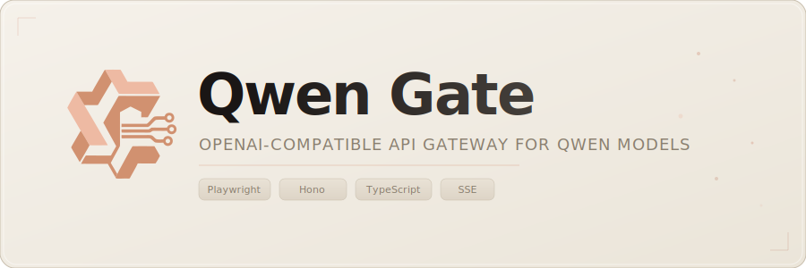
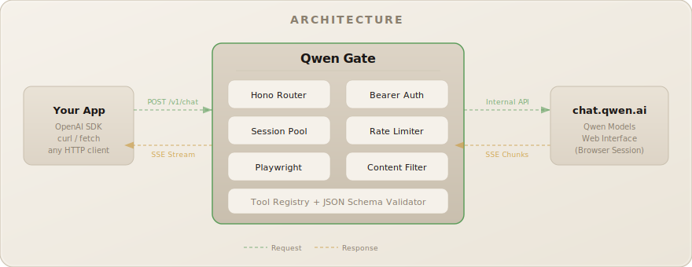

# Qwen Gate

<p align="center">
  
</p>

[](https://opensource.org/licenses/MIT)
[](https://bun.sh/)
[](https://github.com/youssefvdel/qwen-gate/releases)
[](https://www.typescriptlang.org/)
[](https://bun.sh)

> **Disclaimer**: This project is for educational and study purposes. It provides access to Qwen models via `chat.qwen.ai` browser automation. Not affiliated with Alibaba Group or Qwen. Users must comply with `chat.qwen.ai`'s terms of service.

---

## Quick Start

```bash
curl -sSL https://raw.githubusercontent.com/youssefvdel/qwen-gate/main/install.sh | bash
cd qwen-gate
qg
```

Then open [http://localhost:26405/dashboard](http://localhost:26405/dashboard) to add accounts and start using the API.

## Features

- **Free Qwen Models** — Use Qwen 3.7-Max, Qwen 3-Max, Qwen 3-Plus, and more for free in your existing tools. Point Claude Code, OpenCode, Qwen Code, Cursor, or any OpenAI-compatible client at Qwen Gate and use Qwen models without paying per-token.
- **OpenAI-Compatible API** — Drop-in replacement for `/v1/chat/completions` and `/v1/models`. Works with existing OpenAI SDKs, curl, or any HTTP client.
- **Multi-Account Rotation** — Configure multiple Qwen accounts (3+ recommended). Requests are distributed via round-robin with automatic failover and cooldown tracking — cooldown limits become a non-issue.
- **Session Pooling** — Browser sessions are pooled, reused, and autoscaled under load. No per-request login overhead.
- **Tool Calling** — Full OpenAI-style function calling with JSON Schema validation and spam guards.
- **Streaming SSE** — Server-Sent Events with heartbeat keep-alive and content filter integrity maintained across stream boundaries.
- **Content Filter Pipeline** — Strips thinking tags and filters internal artifacts from model output.
- **Web Dashboard** — Real-time monitoring with 5 pages: overview, request log, account manager, network debug, and settings.
- **Dual Transport** — Pure Node.js fetch via wreq-js for requests, Playwright browser automation for login/auth only. No browser needed for API calls.
- **File Upload** — Large context payloads auto-uploaded as Qwen file attachments. Context above limit goes to `context.txt`, latest user message stays inline for low latency.
- **No Build Step** — TypeScript executed directly via Bun. Run from source with no compilation needed.
- **Bun-Powered** — Native TypeScript execution, built-in test runner, and cluster mode for multi-core utilization.

## Installation

### One-Command Install (Linux / macOS)

```bash
curl -sSL https://raw.githubusercontent.com/youssefvdel/qwen-gate/main/install.sh | bash
```

This clones the repo, installs dependencies, creates `config.json`, and symlinks the `qg` / `qwengate` / `qwen-gate` CLI commands.

### Windows Install

Open **PowerShell** (as administrator) and run:

```powershell
powershell -ExecutionPolicy Bypass -c "curl.exe -sSL https://raw.githubusercontent.com/youssefvdel/qwen-gate/main/install.ps1 | iex"
```

Or clone manually:

```powershell
git clone https://github.com/youssefvdel/qwen-gate.git
cd qwen-gate
bun install
```

Then run `qg` to start the server.

### Manual Install

```bash
git clone https://github.com/youssefvdel/qwen-gate.git
cd qwen-gate
bun install
```

### Start the Server

```bash
qg
```

Or:

```bash
bun start
```

The server starts on [http://localhost:26405](http://localhost:26405).

### Add Accounts

> **⚠️ Best practice:** Use **3+ accounts** for round-robin rotation to bypass cooldown limits. Do **not** use your personal Qwen account — create dedicated accounts.

1. Open [http://localhost:26405/dashboard/accounts](http://localhost:26405/dashboard/accounts)
2. Enter your Qwen email and password
3. Click **Add Account** — the gateway handles login and session persistence

## Usage

### Use with Any OpenAI-Compatible Client

Qwen Gate works with any tool that speaks OpenAI's API: **Claude Code, OpenCode, Qwen Code, Cursor**, standard OpenAI SDKs (Python, Node.js, curl), and anything else using the `/v1/chat/completions` format — just point it at `http://localhost:26405/v1`.

> **Tip:** Use `model: "qwen3-7-max"` for the latest Qwen model. Available models: `qwen3-7-max`, `qwen3-6-plus`, `qwen3-max`, `qwen3-coder`, `qwen3-5-plus`, `qwen3-5-flash`, and more.

### Chat Completion

```bash
curl -X POST http://localhost:26405/v1/chat/completions \
  -H "Content-Type: application/json" \
  -H "Authorization: Bearer your-api-key" \
  -d '{
    "model": "qwen3-max",
    "messages": [{"role": "user", "content": "Hello!"}]
  }'
```

### Streaming

Set `"stream": true` for SSE:

```bash
curl -X POST http://localhost:26405/v1/chat/completions \
  -H "Content-Type: application/json" \
  -H "Authorization: Bearer your-api-key" \
  -d '{"model": "qwen3-max", "stream": true, "messages": [{"role": "user", "content": "Count to 5"}]}'
```

### Tool Calling

> **How it works:** Qwen doesn't natively support tool calling — it outputs tool calls as JSON text in its response. The gateway parses that text and converts it into OpenAI-compatible tool call objects. It's not perfect, but it works for most use cases.

```bash
curl -X POST http://localhost:26405/v1/chat/completions \
  -H "Content-Type: application/json" \
  -H "Authorization: Bearer your-api-key" \
  -d '{
    "model": "qwen3-max",
    "messages": [{"role": "user", "content": "Weather in Paris?"}],
    "tools": [{
      "type": "function",
      "function": {
        "name": "get_weather",
        "parameters": {
          "type": "object",
          "properties": {"city": {"type": "string"}},
          "required": ["city"]
        }
      }
    }]
  }'
```

## Configuration

All settings in `config.json`. Key options:

| Key                       | Default      | Description                                     |
| ------------------------- | ------------ | ----------------------------------------------- |
| `PORT`                    | `"26405"`    | Server port                                     |
| `API_KEY`                 | `""`         | Bearer token for API auth (empty = no auth)     |
| `BROWSER`                 | `"chromium"` | Browser engine: `chromium`, `firefox`, `webkit`, `chrome`, `edge` |
| `TOOL_CALLING`            | `"true"`     | Enable tool call parsing                        |
| `CLEAN_OUTPUT`            | `"true"`     | Strip internal artifacts from responses         |
| `STREAMING_MODE`           | `"auto"`     | Streaming mode: `auto`, `on`, `off`             |
| `SAVE_REQUEST_LOGS`       | `"false"`    | Save per-request logs to disk                   |
| `OPEN_DASHBOARD_ON_START` | `"false"`    | Auto-open dashboard in browser                  |
| `RATE_LIMIT_COOLDOWN_MS`  | `"120000"`   | Cooldown after rate limit (2 min)               |
| `RETRY_MAX_ATTEMPTS`      | `"3"`        | Max retry attempts                              |

> **Note:** This is a partial list of 10 commonly-used keys. See `ConfigSchema` in `src/services/configService.ts` for the full list.

## Architecture

<p align="center">
  
</p>

## Web Dashboard

Accessible at `http://localhost:26405/dashboard`.

| Page         | Path                  | Purpose                                              |
| ------------ | --------------------- | ---------------------------------------------------- |
| **Overview** | `/dashboard`          | KPIs, model health, system logs, session pool status |
| **Logs**     | `/dashboard/logs`     | Real-time request log with expandable entry details  |
| **Accounts** | `/dashboard/accounts` | Add/remove Qwen accounts, view auth status           |
| **Network**  | `/dashboard/network`  | Outbound API call inspector                          |
| **Settings** | `/dashboard/settings` | Live config editor (changes apply instantly)         |

## CLI

Three binary aliases: `qg`, `qwengate`, `qwen-gate`.

```text
Usage: qg [command] [options]

Commands:
  start          Start the API server (default)
  update         Pull latest code and reinstall dependencies
  restart        Restart the running server
  status         Check if the server is running
  help           Show help message

Options:
  --port <n>     Override port
  --browser <e>  Browser engine: chromium, firefox, webkit, chrome, edge
  --host <addr>  Bind address

Account management is done via the web dashboard → Accounts page.
```

## Updating

### Via CLI (easiest)

```bash
qg update
```

This runs `git pull --ff-only && bun install`. Then restart the server:

```bash
qg restart
```

### Manual

```bash
git pull && bun install && qg restart
```

### Re-run the installer

```bash
# Linux / macOS
curl -sSL https://raw.githubusercontent.com/youssefvdel/qwen-gate/main/install.sh | bash

# Windows (PowerShell)
powershell -ExecutionPolicy Bypass -c "curl.exe -sSL https://raw.githubusercontent.com/youssefvdel/qwen-gate/main/install.ps1 | iex"
```

The server checks for new GitHub releases on startup and logs a warning in the dashboard when an update is available.

## Project Structure

```text
src/
├── cli.ts                   CLI entry (qg command parser)
├── cluster.ts               Multi-core cluster mode
├── index.tsx                Hono server, routing, CORS, auth
├── models.json              Model definitions (context lengths, modalities)
├── routes/                  API route handlers
│   ├── chat.ts              Chat completions dispatch
│   ├── chatHelpers.ts       Chat request orchestration helpers
│   ├── chatStreaming.ts     Streaming SSE logic
│   ├── chatNonStreaming.ts  Non-streaming responses
│   ├── chatHelpersCore.ts   Core chat response handling
│   ├── chatStreamingHelpers.ts Streaming helper utilities
│   ├── cleanupHelpers.ts    Cleanup logic
│   ├── compressToolResult.ts Tool result compression
│   ├── streamLoop.ts        Streaming loop with idle timeout
│   ├── writeHelpers.ts      Write helper utilities
│   ├── accounts.ts          Account CRUD API
│   ├── config.ts            Config read/write API
│   └── dashboard/           Web dashboard (vanilla HTML/JS)
│       ├── accounts.ts      Account management page
│       ├── dashboardRoutes.ts  Dashboard routing hub
│       ├── logs.ts          Request log page
│       ├── monitor.ts       Real-time monitoring page
│       ├── network.ts       Network debug page
│       ├── overview.ts      Dashboard overview/KPI page
│       ├── settings.ts      Settings page
│       ├── sidebar.ts       Sidebar navigation
│       └── public/          Static dashboard assets (JS/CSS/SVG)
├── services/                Business logic
│   ├── accountManager.ts    Account CRUD, round-robin rotation
│   ├── auth.test.ts         Auth test suite
│   ├── auth.ts              Auth orchestration
│   ├── browserlessFetch.ts  Browserless fetch transport
│   ├── browserProfiles.ts   Browser profile management
│   ├── bxTokenExtractor.ts  Browserless token extraction
│   ├── bxUaGenerator.test.ts User-agent generator tests
│   ├── bxUaGenerator.ts     User-agent generation
│   ├── configService.test.ts Config service tests
│   ├── configService.ts     Config loader
│   ├── defaultSystemPrompt.ts Default system prompt
│   ├── fireyejsRunner.ts    FireyeJS sandbox runner
│   ├── logStore.test.ts     Log store tests
│   ├── logStore.ts          In-memory log store + SSE
│   ├── loginHelpers.ts      Login helper utilities
│   ├── loginService.ts      Login orchestration service
│   ├── modelHealth.ts       Model health tracking
│   ├── modelRouter.ts       Model routing & fallback
│   ├── monitorStore.ts      Monitoring data store
│   ├── networkDebug.ts      Outbound call capture
│   ├── playwright.ts        Browser init & management
│   ├── qwen.ts              Qwen API interaction
│   ├── qwenFileUpload.ts    Qwen file upload handling
│   ├── qwenLogger.ts        Qwen-specific logging
│   ├── qwenModels.ts        Model fetching & mapping
│   ├── sessionPool.ts       Session pool with autoscaling
│   ├── systemLogger.ts      System-wide logger
│   ├── tokenCache.ts        Token caching layer
│   └── tokenRefresh.ts      Token refresh logic
├── tools/                   Tool calling system
│   ├── registry.ts          Tool registry
│   ├── xmlToolParser.ts     XML tool call parsing
│   ├── guard.ts             Spam/abuse guard
│   ├── schema.ts            JSON Schema validation
│   └── schemaValidators.ts  Schema validation helpers
├── utils/                   Shared utilities
│   ├── auth.ts              Auth utilities
│   ├── contentFilter.ts     Streaming content filter
│   ├── paths.ts             Path utilities
│   ├── retry.ts             Exponential backoff
│   ├── tagNames.ts          Centralized tag names
│   ├── thinkTagStripper.ts  Think tag stripping
│   ├── tokenEstimator.ts    Token estimation
│   ├── version.ts           Version information
│   ├── xmlStripper.ts       XML/tool call artifact removal
│   └── xmlStripper.test.ts  XML stripper tests
├── tests/                   Integration tests
├── types/                   TypeScript interfaces
└── middleware/
    └── rateLimit.ts         Token bucket rate limiter
```

## Testing

```bash
bun test
```

Uses Bun's built-in test runner. Covers content filtering, tool-call parsing, streaming sanitization, bx-ua generation, and config service.

## Documentation

| Document                             | Description                                   |
| ------------------------------------ | --------------------------------------------- |
| [Architecture](docs/ARCHITECTURE.md) | System design, component breakdown, data flow |
| [API Reference](docs/API.md)         | Full endpoint documentation                   |
| [Deployment](docs/DEPLOYMENT.md)     | Production deployment guide                   |
| [Development](docs/DEVELOPMENT.md)   | Contributing, testing, code conventions       |

## Star History

<a href="https://www.star-history.com/?repos=youssefvdel%2Fqwen-gate&type=date&legend=top-left">
 <picture>
   <source media="(prefers-color-scheme: dark)" srcset="https://api.star-history.com/chart?repos=youssefvdel/qwen-gate&type=date&theme=dark&legend=top-left" />
   <source media="(prefers-color-scheme: light)" srcset="https://api.star-history.com/chart?repos=youssefvdel/qwen-gate&type=date&legend=top-left" />
   
 </picture>
</a>

## License

MIT — see [LICENSE](LICENSE).
